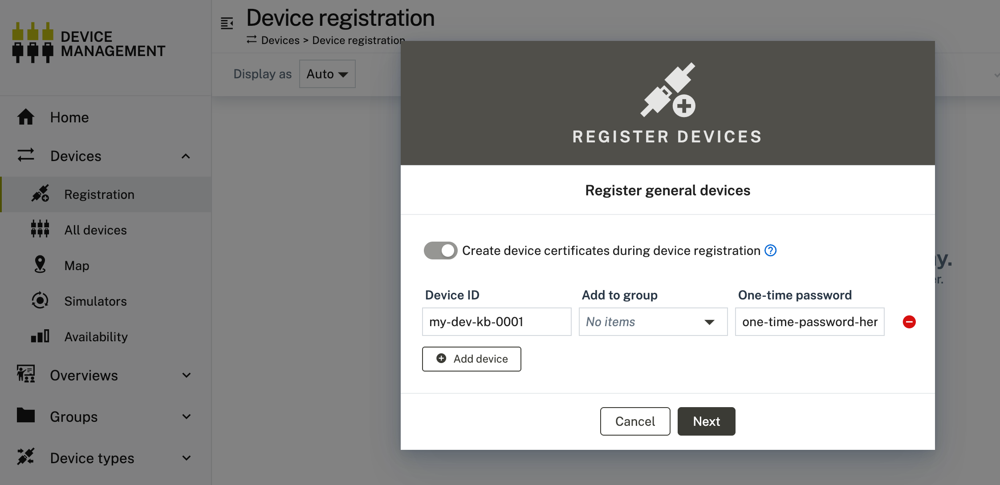
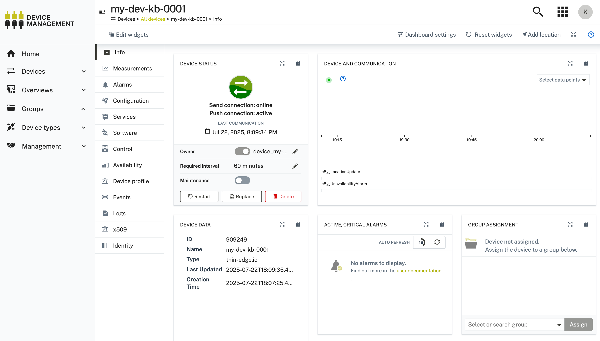
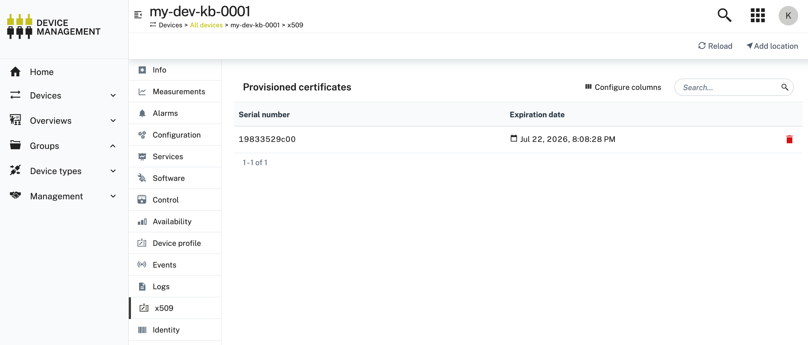

# About

In this step we're connecting to Cumulocity via x.509 certificates issued by the Cumulocity CA. See also https://thin-edge.github.io/thin-edge.io/references/certificate-management/#cumulocity-certificate-authority for further information.

# Instructions

Use below script on the Device:

```sh
#!/bin/sh

# Your Cumulocity tenant URL
TENANT_URL=example.eu-latest.cumulocity.com

# Can be any value, but must be unique. Typically this is the serial number my-of your hardware
DEVICE_IDENTIFIER=my-dev-kb-0001

# Can be any password, choose freely - but make sure it adheres to the password policy of Cumulocity
ONE_TIME_PASSWORD="one-time-password-here"

sudo tedge config set c8y.url "${TENANT_URL}"
sudo tedge cert download c8y \
    --device-id "${DEVICE_IDENTIFIER}" \
    --one-time-password "${ONE_TIME_PASSWORD}"
```

At this point thin-edge.io starts "pinging" the platform with the stated device-id and one-time-password. Go to Cumulocity > Device Management > Devices Registration > Single Registration and put device-identifier and one-time-password in the registration dialogue



Once the registration is done by the User, thin-edge.io will receive a x.509 certificate on next ping. Output should be:

```
Certificate downloaded successfully
    => the device can now be connected

Certificate:   /etc/tedge/device-certs/tedge-certificate.pem
Subject:       CN=my-dev-kb-0001, O=Thin Edge, OU=Device
Issuer:        O=example.eu-latest.cumulocity.com, CN=t2096211728
Status:        VALID (expires in: 364d 23h 59m 59s)
Valid from:    Tue, 22 Jul 2025 18:08:28 +0000
Valid until:   Wed, 22 Jul 2026 18:08:28 +0000
Serial number: 1753207708672 (0x19833529c00)
Thumbprint:    3A3340F59242A63E51662AABEBD50F576F48EE81
```

Now you can connect via `sudo tedge connect c8y`:

```sh
sudo tedge connect c8y
connect to Cumulocity cloud.:
	device id: my-dev-kb-0001
	cloud profile: <none>
	cloud host: example.eu-latest.cumulocity.com:8883
	auth type: Certificate
	certificate file: /etc/tedge/device-certs/tedge-certificate.pem
	cryptoki: off
	bridge: mosquitto
	service manager: systemd
	mosquitto version: 2.0.11
	proxy: Not configured
Creating device in Cumulocity cloud... ✓
Restarting mosquitto... ✓
Waiting for mosquitto to be listening for connections... ✓
Verifying device is connected to cloud... ✓
Enabling tedge-mapper-c8y... ✓
Checking Cumulocity is connected to intended tenant... ✓
Enabling tedge-agent... ✓
```

And we're good. Now you'll see the Device in Cumulocity exists:



And it lists the issues x.509 certificate in the respective Tab:



From this moment on, thin-edge.io will monitor the expiration time of your certificate and auto-renew it before expiry. If the Device is not online before the certificate expires, it needs to be onboarded again (same steps as above). 