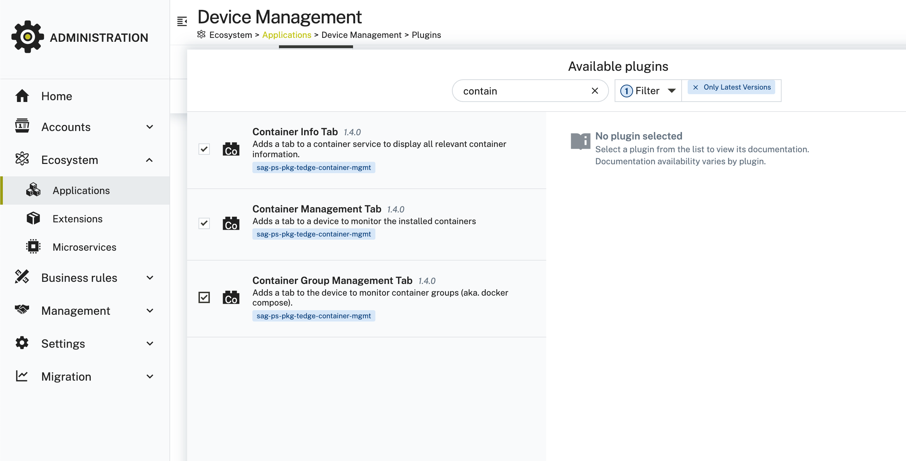
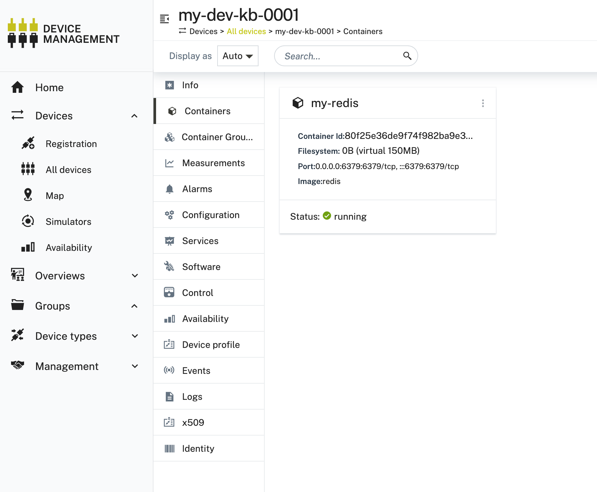

# About

In this step we're enabling Users to monitor, install and uninstall Containers (and Container Groups, e.g. docker/podman compose) from remote via Cumulocity.

# Install the UI plugin

To see and manage Containers in Cumulocity, you need to install this UI plugin to your application: https://github.com/thin-edge/tedge-container-plugin-ui

To do so:

* Go to Administration > Ecosystem > Extensions > Add Extension Package

* Upload the Zip file provided in https://github.com/thin-edge/tedge-container-plugin-ui/releases/

* Now go to Administration > Ecosystem > Extensions > Applications and clone Device Management

* Install the plugin to your cloned Device Management:



# Install tedge-container-plugin on the Device

In this step we are installing the thin-edge plugin on the device. It's this project: https://github.com/thin-edge/tedge-container-plugin

First, setup the community repository via below command:

```sh
curl -1sLf \
  'https://dl.cloudsmith.io/public/thinedge/community/setup.deb.sh' \
  | sudo -E bash
```

Now install the plugin via:

```sh
sudo apt-get install tedge-container-plugin-ng=2.4.2
```

Let's verify it's running:

```sh
sudo systemctl status tedge-container-plugin
● tedge-container-plugin.service - thin-edge.io container monitor
     Loaded: loaded (/lib/systemd/system/tedge-container-plugin.service; enabled; preset: enabled)
     Active: active (running) since Tue 2025-07-22 20:33:27 CEST; 37s ago
   Main PID: 7219 (tedge-container)
      Tasks: 9 (limit: 4615)
     Memory: 7.5M
        CPU: 67ms
     CGroup: /system.slice/tedge-container-plugin.service
             └─7219 /usr/bin/tedge-container run --config /etc/tedge/plugins/tedge-container-plugin.toml
```

In case you see "Cannot connect to docker daemon" in the journal, make sure docker is installed. If not, follow https://docs.docker.com/engine/install/debian/#install-using-the-repository to install it. 

To test if everything is working, let's run a sample container via `sudo docker run -d --name my-redis -p 6379:6379 redis`. Once it's running, go to your Cumulocity Device and see it shown in Container Tab:

