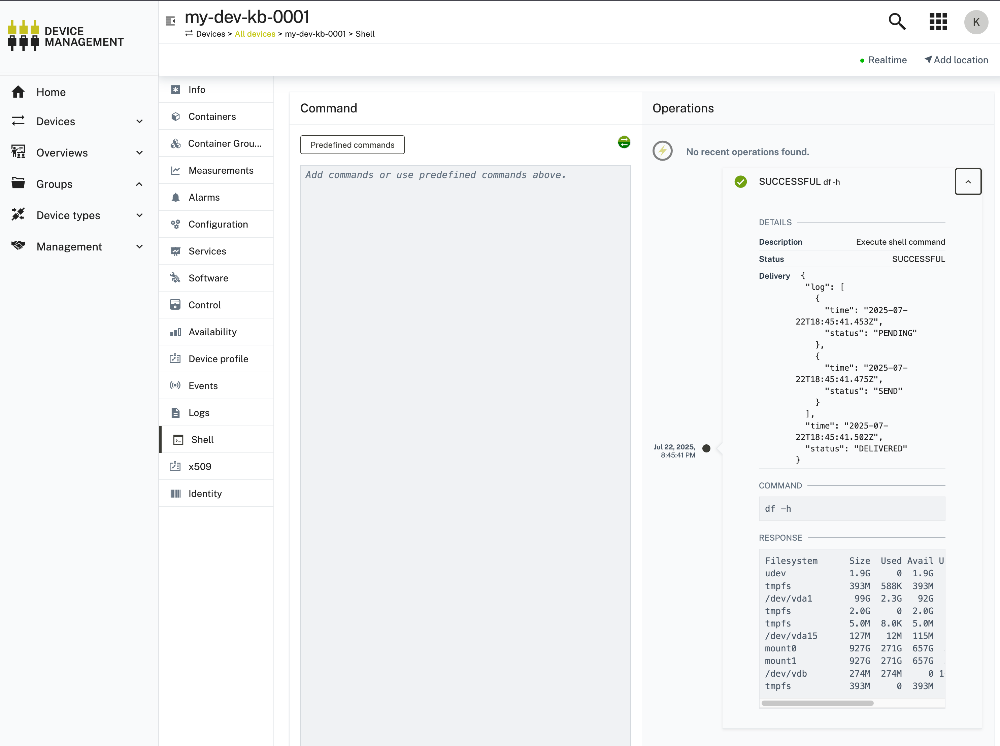

# About

In this step, we're installing the `c8y-command` plugin, which allows Users to send ad-hoc shell commands from remote to a Device. The User will also see the response from the Device live.

# Instructions

Set up the thin-edge community repository on your Device (if not already done in previous steps)

```sh
curl -1sLf \
  'https://dl.cloudsmith.io/public/thinedge/community/setup.deb.sh' \
  | sudo -E bash
```

And install it on your Device:

```sh
sudo apt-get install c8y-command-plugin=0.0.3
```

Now you'll be able to see Shell Tab in Cumulocity. Let's test it and send a command to the Device:



If all goes well, you'll see a successful operation on the right side. You can expand the entry and inspect the Device response to your shell command.