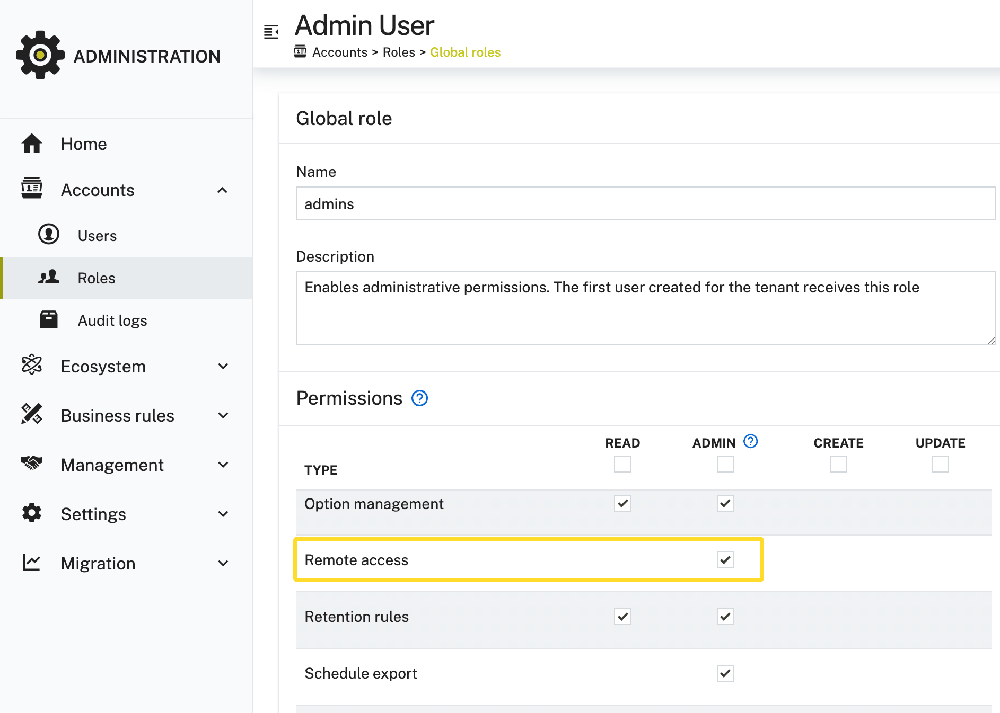
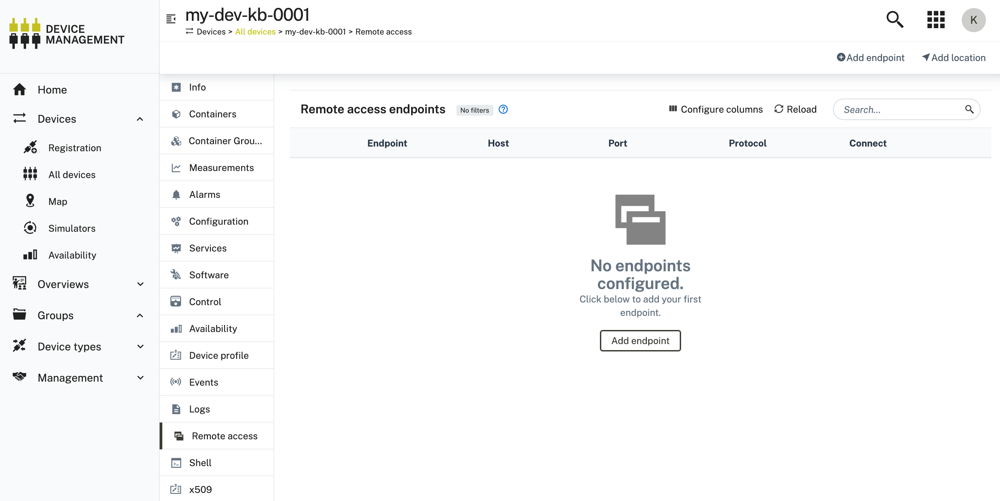
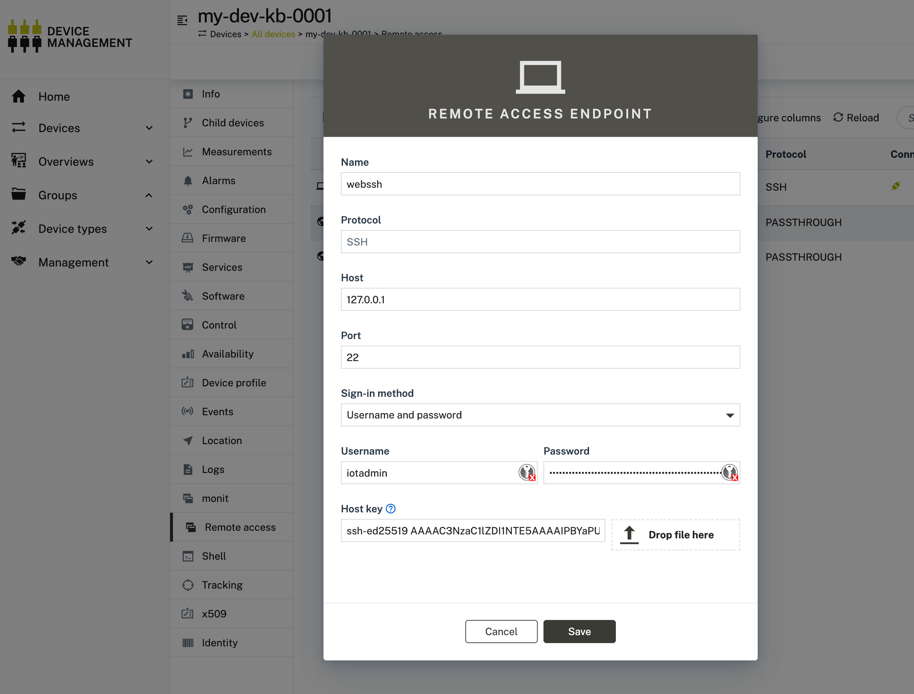
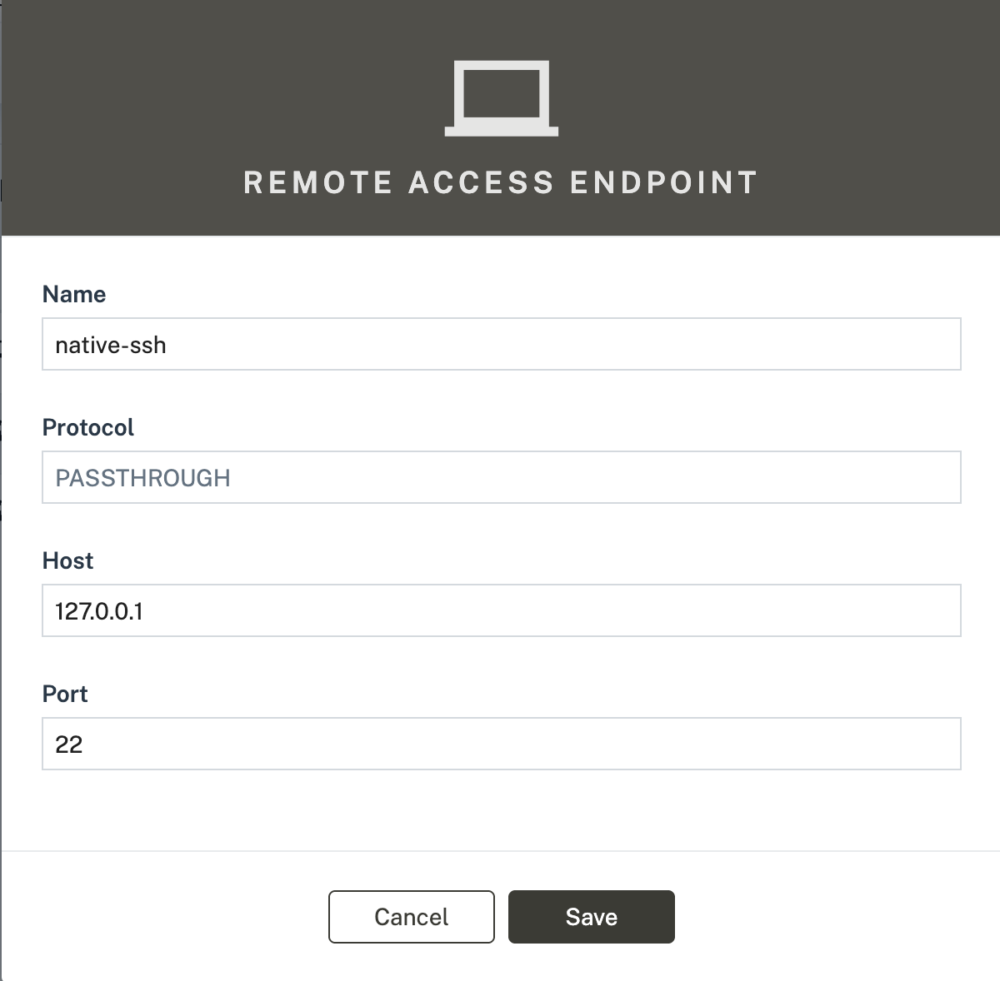

# About

Users are able to login to Devices in Cumulocity via SSH. This step explains how to set this up. 

# Instruction

There is no installation needed, the functionality is already available on the Device and Cloud by default. All you need to make sure is that your User has the proper `Remote Access Admin` permission. To set this permission, go to Administration > Accounts > Roles and activate the Remote-Access Permission on your User Role:



Now go to your Device within Device Management. You should see now the `Remote Access` Tab on your thin-edge Device:



## WebSSH

Let's create our first connection via webSSH, configure:



And connect within your Browser:


## Native/Passthrough SSH

A much more developer-friendly and performant way to connect to your Device via SSH is the passthrough option. This allows you to connect to the Device from your local terminal. 
See here for the technical concept behind this: 

To use it, first create a passthrough configuration. All you need to set is target host and port:




Next, use the great [go-c8y-cli](https://goc8ycli.netlify.app/docs/introduction/) tool. It's a CLI that let's you interact with the Cumulocity API in general, it also supports the remote SSH feature. 

Use below command on your localhost to connect to your Device via SSH:

```sh
$ c8y remoteaccess connect ssh --device 549292 --configuration native-ssh  --user iotadmin
Starting interactive ssh session with 549292 (https://example.eu-latest.cumulocity.com)
Last login: Tue Jul 22 19:04:12 2025 from 127.0.0.1

iotadmin@tedge:~$ pwd
/home/iotadmin
```

