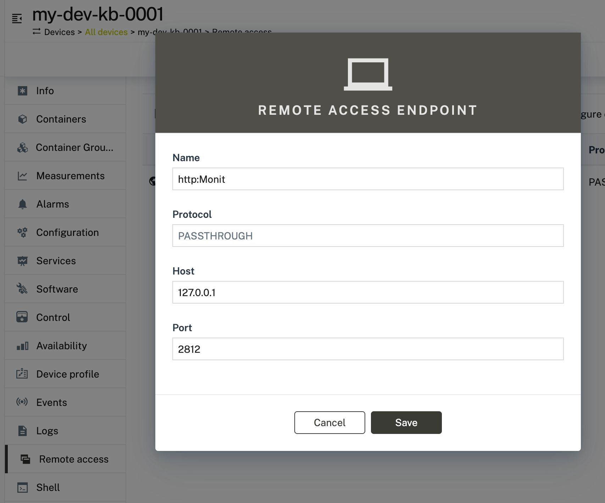
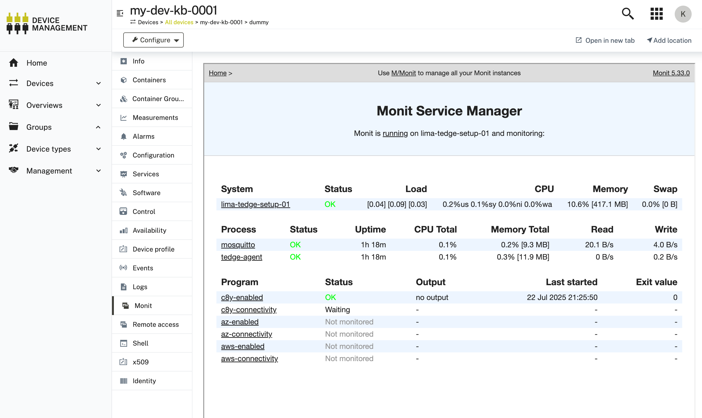

# About

In this step we're using the [Cloud HTTP Proxy](https://github.com/Cumulocity-IoT/cumulocity-remote-access-cloud-http-proxy) to access a local webserver from Cumulocity via thin-edge.
In this example, I'll show how to install and access the tool Monit. Note that Monit is an example, you can access _any_ locally running web-UI with this functionality.

# Prerequisits

This feature relis on Cumulocity's [Cloud Remote Access](https://cumulocity.com/docs/cloud-remote-access/cra-introduction/) feature. To enable it for your tenant, please first finish these required [configuration steps](https://github.com/Cumulocity-IoT/cumulocity-remote-access-cloud-http-proxy/releases?tab=readme-ov-file#prerequisits--limitations).

# Instructions

This feature needs the `cloud-http-proxy` Microservice being running in your Cumulocity Tenant. This should be the case by default. If not, find the latest release [here](https://github.com/Cumulocity-IoT/cumulocity-remote-access-cloud-http-proxy/releases) and upload the Microservice in Administration > Ecosystem > Microservices. 

A UI-Plugin needs to be installed for the cloned Device Management Application. You can either search it in Administration -> Ecosystem -> Extensions -> Package List or upload [the latest UI extensions](https://github.com/Cumulocity-IoT/cumulocity-remote-access-cloud-http-proxy/releases) in the same place. 

On thin-edge side there is nothing additionally to install for this functionality. But of course, we first need a Webserver running to demonstrate the feature. So let's install the tool `monit` now. The installation including sensible defaults can be done with [tedge-monit-setup](https://github.com/thin-edge/tedge-monit-setup) package:

```sh
# Setup community plugin (if not already done in previous steps)
curl -1sLf \
  'https://dl.cloudsmith.io/public/thinedge/community/setup.deb.sh' \
  | sudo -E bash

# install
sudo apt-get install tedge-monit-setup=0.4.3
```

On Cloud-Side, go to your Device and configure the below endpoint (monit should be running on port 2812 by default)



Once the endpoint is configured, reload the UI Application and you will see a new Tab named "Monit". This tab will show you the web UI that is running on your Device:

