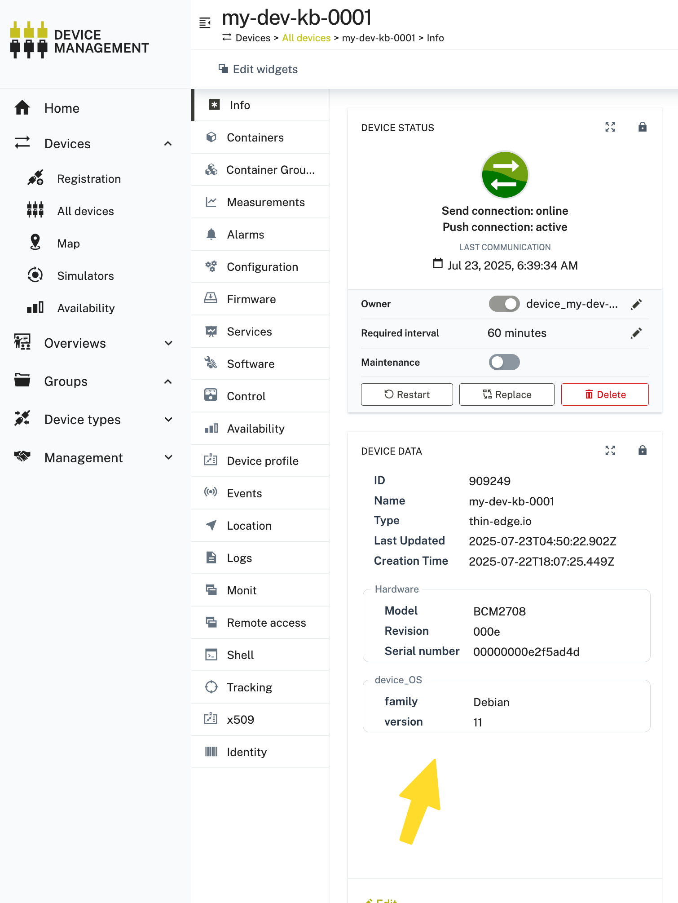
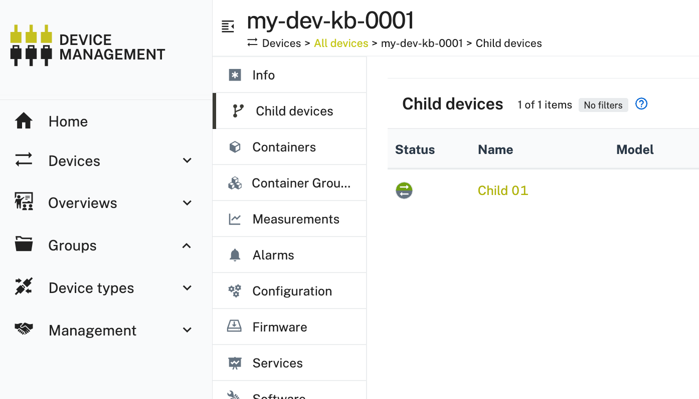

# About

This document is used to list sample commands to produce data in Cumulocity.

## Send Measurement

```sh
tedge mqtt pub 'te/device/main///m/environment' '{
  "three_phase_current": {
    "L1": 9.5,
    "L2": 10.3,
    "L3": 8.8
  }
}'
```

## Send Event

```sh
tedge mqtt pub 'te/device/main///e/login_event' '{
  "text": "A user just logged in"
}'
```

## Send Alarm

```sh
tedge mqtt pub 'te/device/main///a/temperature_high' '{
  "text": "Temperature is very high",
  "severity": "critical"
}'
```

## Change Property

**Option 1: send it to the MQTT broker**

Send below message to the local MQTT Broker, tedge-mapper will pack it up and submit to Cloud.

```sh
tedge mqtt pub 'te/device/main///twin/device_OS' '{
  "family": "Debian",
  "version": "11"
}'
```

Documentation link: [Twin Data](https://thin-edge.github.io/thin-edge.io/references/mappers/c8y-mapper/#twin)

You might want to consider to retain that message via `tedge mqtt pub -r` . This will persist this message on the broker. 


**Option 2: place your (static) properties to the file `/etc/tedge/device/inventory.json`**

The tedge-mapper is reading the `/etc/tedge/device/inventory.json` file and submits all properties to the Cloud (TODO: describe when, on-change, on service restart, on Cloud-connect or periodically). 

To use this, create the stated file, save it with below and do a `sudo tedge reconnect c8y` afterwards:

```sh
{
  "c8y_Firmware": {
    "name": "raspberrypi-bootloader",
    "version": "1.20140107-1",
    "url": "31aab9856861b1a587e2094690c2f6e272712cb1"
  },
  "c8y_Hardware": {
    "model": "BCM2708",
    "revision": "000e",
    "serialNumber": "00000000e2f5ad4d"
  }
}
```

Documentation link: [base inventory model](https://thin-edge.github.io/thin-edge.io/references/mappers/c8y-mapper/#base-inventory-model)

To be able to see these properties, go to the "Info" Tab of your Cloud Device and add it in the "Device Data" widget:



> Note: If you see your properties changing, reason could be the `tedge-inventory-plugin`. It comes with default scripts to update properties about Hardware, Certificate and OS. They are periodically executed. If you want to turn them off, have a look to the README [here](https://github.com/thin-edge/tedge-inventory-plugin). 


## Create and register child device

Below command will tell thin-edge.io there is a child-device named `child01` to manage. 

```sh
tedge mqtt pub -r 'te/device/child-01//' '{
  "@type": "child-device",
  "name": "Child 01",
  "type": "Raspberry Pi 4"
}'
```

After reloading the Cumulocity UI, you should now see a Tab `Child-devices` listing the created Device.




## Send measurement to child device

Note that we registered a child-device with identifier `child-01` in previous step. To send data to it, in this example telemetry data, just use the `child-01` identifier instead of `main` in your MQTT topic:

```sh
tedge mqtt pub 'te/device/child-01///m/environment' '{
  "three_phase_current": {
    "L1": 9.5,
    "L2": 10.3,
    "L3": 8.8
  }
}'
```

This created a measurement on the child-device. All other APIs (events/alarms/twin properties) are having the same logic, all what's differing between the main-device and the child-devices is the entity identifier inside the MQTT topic. 